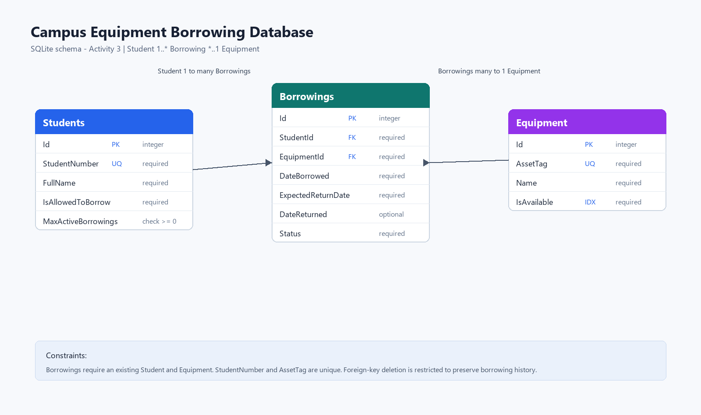

# Campus Equipment Borrowing System

Laboratory Activity 1 for ITSD 81 - Desktop Application Development.

This repository contains the application structure for a campus equipment borrowing system. Laboratory Activity 1 established the domain, application, infrastructure, and test layers. Laboratory Activity 2 extends the same solution with an Avalonia desktop interface using MVVM.

## Part A - System Analysis

### Actors

| Actor | Expectation |
|---|---|
| Authorized Student | Requests to borrow available laboratory equipment and expects the system to approve or reject the request based on borrowing rules. |
| Laboratory Staff | Maintains equipment availability and expects borrowing records to show who borrowed equipment and when it should be returned. |

### Use Cases

| Item | Description |
|---|---|
| Use Case | Borrow Equipment |
| Primary Actor | Authorized Student |
| Preconditions | Student and equipment records are already available in the system. |
| Main Action | Student requests to borrow a specific piece of equipment. |
| Expected Result | The system creates an active borrowing record and marks the equipment unavailable. |
| Possible Failure | Student does not exist, is not allowed to borrow, equipment does not exist, equipment is unavailable, or student reached the active borrowing limit. |

| Item | Description |
|---|---|
| Use Case | Return Equipment |
| Primary Actor | Laboratory Staff |
| Preconditions | There is an active borrowing record for the equipment. |
| Main Action | Staff records the returned equipment. |
| Expected Result | Borrowing is marked returned and equipment becomes available again. |
| Possible Failure | Borrowing record does not exist or has already been returned. |

| Item | Description |
|---|---|
| Use Case | Find Available Equipment |
| Primary Actor | Authorized Student |
| Preconditions | Equipment records exist in the system. |
| Main Action | Student or staff checks which equipment can be borrowed. |
| Expected Result | The system lists equipment currently marked as available. |
| Possible Failure | No equipment is available or the equipment repository cannot provide data. |

### Domain Concepts

| Concept | Information It Contains | Rules or State | Not Its Responsibility |
|---|---|---|---|
| Student | Id, student number, full name, borrowing permission, maximum active borrowings | Knows whether the student is allowed to start another borrowing based on active count | Loading itself from a database or displaying UI messages |
| Equipment | Id, asset tag, name, availability | Can be marked borrowed or available | Deciding which student may borrow it |
| Borrowing | Id, student id, equipment id, borrowed date, expected return date, returned date, status | Starts as active and can be marked returned | Querying repositories or changing equipment storage directly |

## 1. Solution Structure

```text
EquipmentBorrowing/
│
├── README.md
├── EquipmentBorrowing.sln
│
├── src/
│   ├── EquipmentBorrowing.Domain/
│   │   ├── Student.cs
│   │   ├── Equipment.cs
│   │   ├── Borrowing.cs
│   │   └── BorrowingStatus.cs
│   │
│   ├── EquipmentBorrowing.Application/
│   │   ├── Interfaces/
│   │   └── Services/
│   │
│   └── EquipmentBorrowing.Infrastructure/
│       └── Repositories/
│
└── tests/
    └── EquipmentBorrowing.Tests/
```

### Domain

Contains the main problem concepts and rules:

- `Student`
- `Equipment`
- `Borrowing`
- `BorrowingStatus`

### Application

Contains use case coordination and repository abstractions:

- `BorrowEquipmentService`
- `BorrowEquipmentRequest`
- `BorrowEquipmentResult`
- `IStudentRepository`
- `IEquipmentRepository`
- `IBorrowingRepository`

### Infrastructure

Contains technical implementations of application interfaces:

- `InMemoryStudentRepository`
- `InMemoryEquipmentRepository`
- `InMemoryBorrowingRepository`

These can later be replaced by database-backed repositories without changing the application service.

### Tests

Contains the initial test project structure. More tests can be added later for domain behavior and application services.

## 2. Dependency Direction

```text
Console Demo / Future UI
        |
        ↓
Application ----> Domain
        ↑
        |
Infrastructure
```

Project references:

- `EquipmentBorrowing.Domain` depends on no other project.
- `EquipmentBorrowing.Application` depends on `Domain`.
- `EquipmentBorrowing.Infrastructure` depends on `Application` and `Domain`.
- `EquipmentBorrowing.Console` depends on `Application`, `Domain`, and `Infrastructure`.
- `EquipmentBorrowing.Tests` depends on `Application` and `Domain`.

The application layer depends on repository interfaces, not repository implementations. Infrastructure implements those interfaces.

## 3. Use Case Mapping

```text
Actor:
Authorized Student

Use Case:
Borrow Equipment

Application Service:
BorrowEquipmentService

Domain Objects Used:
Student, Equipment, Borrowing, BorrowingStatus

Repository Interfaces Used:
IStudentRepository, IEquipmentRepository, IBorrowingRepository

Infrastructure Implementations Used:
InMemoryStudentRepository, InMemoryEquipmentRepository, InMemoryBorrowingRepository
```

## 4. Reflection

1. The application service should depend on repository interfaces because the use case should not care whether data comes from memory, a file, SQLite, or another database. This keeps business logic separate from storage details.

2. If SQLite were added later, the `Domain` project, repository interfaces, and `BorrowEquipmentService` could remain mostly unchanged. The main change would be adding SQLite repository implementations in `Infrastructure`.

3. Avalonia Views would eventually belong in a separate UI project, such as `EquipmentBorrowing.Desktop`, not in `Domain`, `Application`, or `Infrastructure`.

4. An Avalonia button should not directly execute database queries. It should call an application service, and the application service should coordinate the use case through interfaces.

5. `BorrowEquipmentService.BorrowAsync` represents the actual business operation requested by the actor. It validates the student, equipment, availability, active borrowing limit, and then creates the borrowing record.

## Running the Demonstration

From the repository root:

```text
dotnet run --project src/EquipmentBorrowing.Console/EquipmentBorrowing.Console.csproj --no-restore
```

The console program demonstrates one successful borrowing request and one failed request where a student is not allowed to borrow equipment.

## Laboratory Activity 2 - Avalonia UI and MVVM

### Desktop Project

`EquipmentBorrowing.Desktop` is the presentation layer of the system. It is responsible for:

- displaying equipment and active borrowing information;
- collecting user input;
- maintaining presentation state in ViewModels;
- invoking application services through commands; and
- showing success, validation, and failure messages to the user.

The Desktop project references `EquipmentBorrowing.Application`, `EquipmentBorrowing.Domain`, and `EquipmentBorrowing.Infrastructure` so it can compose the working application. The existing Domain and Application projects do not reference Avalonia.

### Updated Architecture

```text
Avalonia View
      |
      | Binding / Command
      v
ViewModel
      |
      | Application Operation
      v
Application Service
      |
      +----------> Domain
      |
      v
Repository Interface
      ^
      |
Infrastructure Implementation
```

The View contains XAML layout and bindings. The ViewModel contains selected values, observable collections, commands, and user-facing messages. Application services contain the use case workflow and business validation. Infrastructure repositories provide in-memory storage behind repository interfaces.

### Borrow Equipment Flow

1. The user opens the Equipment section.
2. `EquipmentView` displays students and equipment using XAML data binding.
3. The user selects a student, selects equipment, chooses an expected return date, and presses `Borrow Equipment`.
4. `EquipmentViewModel` performs presentation validation, such as checking that a student and equipment item were selected.
5. `EquipmentViewModel` calls `BorrowEquipmentService.BorrowAsync`.
6. `BorrowEquipmentService` checks the business rules: student exists, student is allowed, equipment exists, equipment is available, and the student has not reached the active borrowing limit.
7. If the request is valid, the service creates a borrowing record and marks the equipment unavailable.
8. The ViewModel refreshes the equipment list and displays the result message.

### Return Equipment Flow

1. The user opens the Active Borrowings section.
2. `BorrowingsView` displays active borrowing records using XAML data binding.
3. The user selects an active borrowing and presses `Return Equipment`.
4. `BorrowingsViewModel` checks that a borrowing was selected.
5. `BorrowingsViewModel` calls `ReturnEquipmentService.ReturnAsync`.
6. `ReturnEquipmentService` locates the borrowing, verifies that it has not already been returned, marks it returned, and marks the equipment available again.
7. The ViewModel refreshes the active borrowing list and displays the result message.

### Activity 2 Components

```text
src/
├── EquipmentBorrowing.Application/
│   ├── Interfaces/
│   └── Services/
│       ├── BorrowEquipmentService.cs
│       ├── ReturnEquipmentService.cs
│       ├── EquipmentCatalogService.cs
│       ├── StudentCatalogService.cs
│       └── ActiveBorrowingsService.cs
│
├── EquipmentBorrowing.Infrastructure/
│   └── Repositories/
│
└── EquipmentBorrowing.Desktop/
    ├── Views/
    │   ├── EquipmentView.axaml
    │   └── BorrowingsView.axaml
    ├── ViewModels/
    │   ├── MainWindowViewModel.cs
    │   ├── EquipmentViewModel.cs
    │   └── BorrowingsViewModel.cs
    ├── App.axaml
    ├── App.axaml.cs
    └── MainWindow.axaml
```

### Architectural Reflection

1. The View should not call a repository directly because the View's job is presentation, not data access or business workflow coordination.

2. Business rules should not be implemented in the ViewModel because those rules belong to the existing Domain and Application layers. Keeping them there allows the same rules to be reused by a console app, desktop app, test project, or future web interface.

3. The ViewModel is responsible for presentation state, selected values, observable collections, commands, simple input validation, and user-facing feedback.

4. The Application layer can work without knowing Avalonia is being used because it exposes ordinary C# services and interfaces. Avalonia only appears in the Desktop project.

5. Registering dependencies in one composition point keeps object creation organized. ViewModels receive services through constructors instead of creating repositories or services themselves.

6. If the in-memory repositories were replaced by SQLite later, the Views, ViewModels, Domain models, repository interfaces, and application services should remain largely unchanged. The main change would be new Infrastructure repository implementations.

### Running the Desktop Application

From the repository root:

```text
dotnet restore
dotnet build
dotnet run --project src/EquipmentBorrowing.Desktop/EquipmentBorrowing.Desktop.csproj
```

Use the Equipment section to perform a borrowing transaction. Use the Active Borrowings section to return borrowed equipment.

## Laboratory Activity 3 - SQLite Persistence with EF Core

Laboratory Activity 3 replaces the temporary in-memory repositories used in the earlier activities with Entity Framework Core repositories backed by SQLite. The Domain models, Application services, Avalonia Views, ViewModels, commands, and repository interfaces remain in place.

### Relational Database Design



The database has three tables:

- `Students`: `Id` is the primary key. `StudentNumber` is required and unique. `FullName`, `IsAllowedToBorrow`, and `MaxActiveBorrowings` are required. The maximum active borrowing value has a check constraint requiring a value of zero or greater.
- `Equipment`: `Id` is the primary key. `AssetTag` is required and unique. `Name` and `IsAvailable` are required. An index on availability supports the common catalog filter.
- `Borrowings`: `Id` is the primary key. `StudentId` and `EquipmentId` are required foreign keys. `DateReturned` is optional because an active borrowing has not been returned yet. `Status` records whether the borrowing is active or returned.

One Student can have many Borrowings, and one Equipment record can appear in many Borrowings over time. The borrowing table stores only the foreign keys rather than duplicating student or equipment names. Foreign-key deletion is restricted to preserve borrowing history.

### SQLite and EF Core

The Infrastructure project references `Microsoft.EntityFrameworkCore.Sqlite` and `Microsoft.EntityFrameworkCore.Design`. SQLite is used because it provides a persistent relational database in a single local file without adding a server dependency.

`EquipmentBorrowingDbContext` is the EF Core boundary for the database. It exposes `Students`, `Equipment`, and `Borrowings` sets and applies the separate entity configurations in `Persistence/Configurations`. Database startup initialization is performed by `DatabaseInitializer`, not by a View or ViewModel.

At runtime, the database file is created in the current user's local application-data folder:

```text
%LOCALAPPDATA%\EquipmentBorrowing\EquipmentBorrowing.db
```

The initializer applies outstanding migrations and adds the initial students and equipment only when the database contains no students. It does not delete or recreate an existing database.

### Repository Transition

```text
Activity 2
Repository Interface -> InMemory Repository

Activity 3
Repository Interface -> EF Core Repository -> DbContext -> SQLite
```

`EfStudentRepository`, `EfEquipmentRepository`, and `EfBorrowingRepository` implement the existing repository interfaces. The Application services still depend only on those interfaces, so `BorrowEquipmentService` and `ReturnEquipmentService` do not contain SQLite, EF Core, or SQL code.

The Desktop composition root uses `AddDbContextFactory` and registers the EF repositories. Views and ViewModels still communicate through bindings and commands only; neither accesses the DbContext directly.

### Migration Process

Create the initial migration under `src/EquipmentBorrowing.Infrastructure/Migrations` before the first run.

To restore the repository's local EF CLI tool and create a new migration after a future model change:

```text
dotnet tool restore
dotnet tool run dotnet-ef migrations add MeaningfulMigrationName --project src/EquipmentBorrowing.Infrastructure --startup-project src/EquipmentBorrowing.Desktop
```

To apply migrations manually:

```text
dotnet tool run dotnet-ef database update --project src/EquipmentBorrowing.Infrastructure --startup-project src/EquipmentBorrowing.Desktop
```

The normal Desktop startup calls `Database.MigrateAsync()`, so, after the initial migration is committed, a fresh clone creates the schema when the app starts. The SQLite viewer should show `Students`, `Equipment`, `Borrowings`, and `__EFMigrationsHistory`.

### LINQ, SQL, and Tracking

The application uses asynchronous LINQ operations for the equipment catalog, active borrowing details, and active-borrowing count. The active borrowing query joins the Student and Equipment tables and projects only the values the screen needs.

Display-only queries use `AsNoTracking()` because those entities do not need change tracking. Return and equipment-state changes are attached by their repository update methods before `SaveChangesAsync()` persists them.

Two inspected LINQ-to-SQL examples, including the generated SQLite SQL and explanations, are in [docs/generated-sql.md](docs/generated-sql.md). The manual SQL evidence required by the activity is in [docs/database-queries.sql](docs/database-queries.sql).

### Persistence Demonstration

1. Start the Desktop application and borrow an available piece of equipment.
2. Open Active Borrowings and verify the borrowing appears.
3. Close the application completely, start it again, and verify the active borrowing remains.
4. Return the equipment, close the application, start it again, and verify the item is available and the returned borrowing is no longer active.

This confirms that the data is stored in SQLite rather than in process memory.

### Architectural Reflection

1. The application did not need to be rewritten because the earlier services depended on repository interfaces, not on the in-memory implementation.
2. A ViewModel should not use `DbContext` directly because it would mix presentation state with persistence details and bypass the application-service boundary.
3. An EF repository translates the existing repository operations into asynchronous EF Core queries and updates, then saves the resulting database changes.
4. An EF Core migration records a reproducible, versioned schema change so another computer can create the same database structure.
5. Foreign keys ensure every borrowing references a real student and a real equipment record, preserving referential integrity.
6. `AsNoTracking()` can improve read-only queries because EF Core does not need to keep those entities in its change tracker.
7. Replacing SQLite with another provider later would primarily change the Infrastructure provider configuration and repository details; the Views, ViewModels, Domain, and Application services can remain unchanged.
